# implanet

Render a planet's equirectangular map into a 2D orthographic view from any
viewing direction, with optional SPICE-driven sun lighting and a
publication-style matplotlib figure layer.

```
                        +---------- matplotlib figure -----------+
                        |   white bg · dashed graticule · ticks  |
                        |                                        |
   equirectangular  →   |          rendered disk on axes         |
   texture (2:1)        |    [-1,+1] planet radii                |
                        |                                        |
                        |   sub-obs (lat, lon)  ·  sub-solar     |
                        +----------------------------------------+
                                       ↑
                          SPICE (spiceypy) → sun_direction
```

## Install

```bash
pip install implanet                # everything — one command, no extras
```

That single install pulls in numpy, Pillow, spiceypy *and* matplotlib,
so rendering, SPICE ephemerides, and the figure layer all work out of
the box. (Developing the package: `pip install -e .[test]` adds pytest.)

Python ≥ 3.9. One console script is installed:

```bash
implanet-fetch [--list|--cite|--body …]      # bulk-download / inspect maps
```

Everything else is a Python API — `import implanet` and call the
functions directly.

**Assets are not bundled** — textures and SPICE kernels download on first
use. By default they live *with the package*
(`site-packages/implanet/_data/{maps,kernels}`); in a dev checkout the
repo's `maps/data/` and `kernels/` are reused instead. Override with
`IMPLANET_CACHE=/some/dir` (or `IMPLANET_MAPS` / `IMPLANET_KERNELS` for
fine control). The first `ensure_kernels()` pulls ~32 MB of generic NAIF
kernels; individual textures download as you request them.

## Quick start

```python
from PIL import Image
from implanet import render_disk, get_texture

# get_texture downloads (once) and returns a local path. render_disk
# accepts that path directly — no need to open it yourself.
img = render_disk(
    get_texture("Earth"),              # str/Path | PIL.Image | ndarray
    view_direction=(-1, -0.2, -0.3),   # camera → planet center, body-fixed
    sun_direction=(1, 0.5, 0.4),       # planet → Sun
    size=600,
)
Image.fromarray(img).save("earth.png")
# Or plot it yourself — the disk occupies [-1, +1] in planet radii, with
# a small `margin` cushion around it (default 1.05):
#   ax.imshow(img, extent=(-1.05, 1.05, -1.05, 1.05))
#   ax.set_aspect("equal")
```

Result — a 600×600 RGB PNG, half-lit Earth with the terminator running
through the middle:

<p align="center">
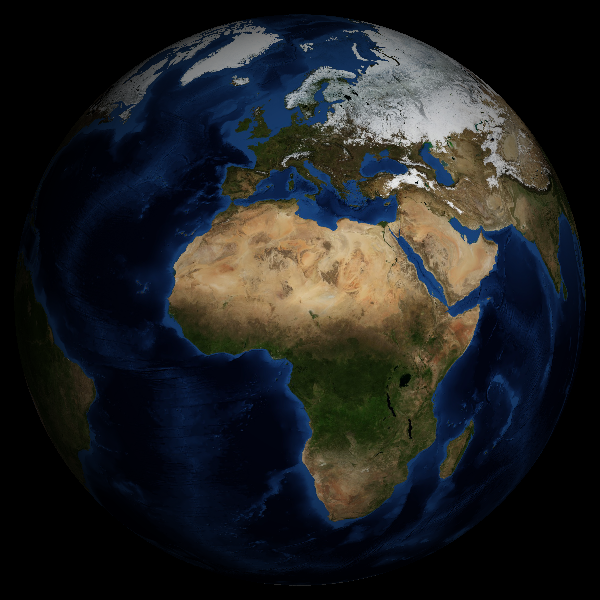
</p>

`get_texture(body, variant=None)` picks the body's default map; pass a
variant for a specific one, e.g. `get_texture("Earth", "natural_earth3")`.

Need a figure caption with the texture credit and the camera/sun
geometry? `render_info` mirrors `render_disk`'s signature and returns
a structured dict plus a one-line caption:

```python
from implanet import render_info
info = render_info(get_texture("Mars"),
                   view_direction=(-1, 0, 0),
                   sun_direction=(1, 0, 0.3))
print(info["caption"])
```

Result:

```
Mars / sss · sub-obs 0°N 0°E · sun (1.00, 0.00, 0.30) · Solar System Scope (CC BY 4.0). Underlying data: NASA MGS MOLA team; Viking Orbiter; USGS Astrogeology.
```

The dict also carries `texture` (body / variant / mission / citation /
license — only populated when the texture path is in the manifest),
`camera` (sub-observer lat/lon), `sun` (sub-solar lat/lon, ambient),
and `output` (size / margin / lon0). For this call:

```python
info["texture"]["body"]     # 'Mars'
info["texture"]["variant"]  # 'sss'
info["camera"]["sub_observer_lat_deg"], info["camera"]["sub_observer_lon_deg"]  # (0.0, 0.0)
info["sun"]["sub_solar_lat_deg"], info["sun"]["sub_solar_lon_deg"]              # (16.7, 0.0)
```

With real ephemerides — SPICE drives the sun direction and the
sub-solar point, you compose a `view_direction` around it, and
`render_disk` does the rest:

```python
import math
from PIL import Image
from implanet import render_disk, sun_direction, sub_solar_point, get_texture

utc = "2026-05-14T12:00:00"
sun = sun_direction("Mars", utc)
lat, lon = sub_solar_point("Mars", utc)
# camera 30° west of the sub-solar point → day side with a visible terminator
lon_cam = math.radians(lon - 30)
lat_cam = math.radians(lat)
view = (-math.cos(lat_cam)*math.cos(lon_cam),
        -math.cos(lat_cam)*math.sin(lon_cam),
        -math.sin(lat_cam))

img = render_disk(get_texture("Mars"),
                  view_direction=view, sun_direction=sun, size=600)
Image.fromarray(img).save("mars.png")
```

Result — Mars at `2026-05-14T12:00:00 UTC`. SPICE puts the sub-solar
point at (−24.6°, −160.2°) on that date; the camera is 30° west of
that, so the terminator slices across the right side of the disk.


## Examples

A small curated showcase of `implanet` output. Each figure is
regenerable from a script in `examples/`; the full output trees there
are git-ignored, only this hand-picked set is committed under
[`docs/figures/`](docs/figures/).

<table>
<tr>
<td width="50%" align="center">
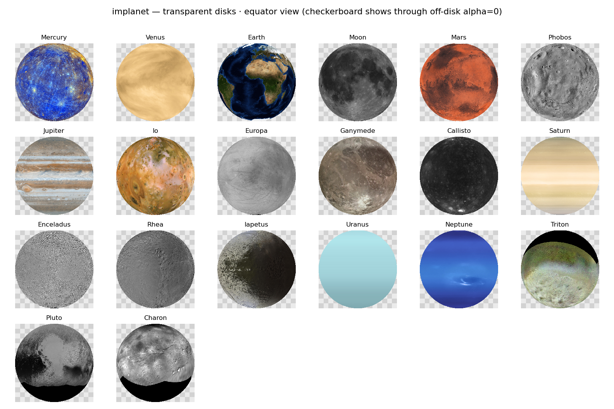<br>
<sub><b>Every body, one view</b> — every body's default texture as a
transparent RGBA disk on an exact [-1,1] grid (equator view). Built by
<code>examples/transparent_disks.py</code>.</sub>
</td>
<td width="50%" align="center">
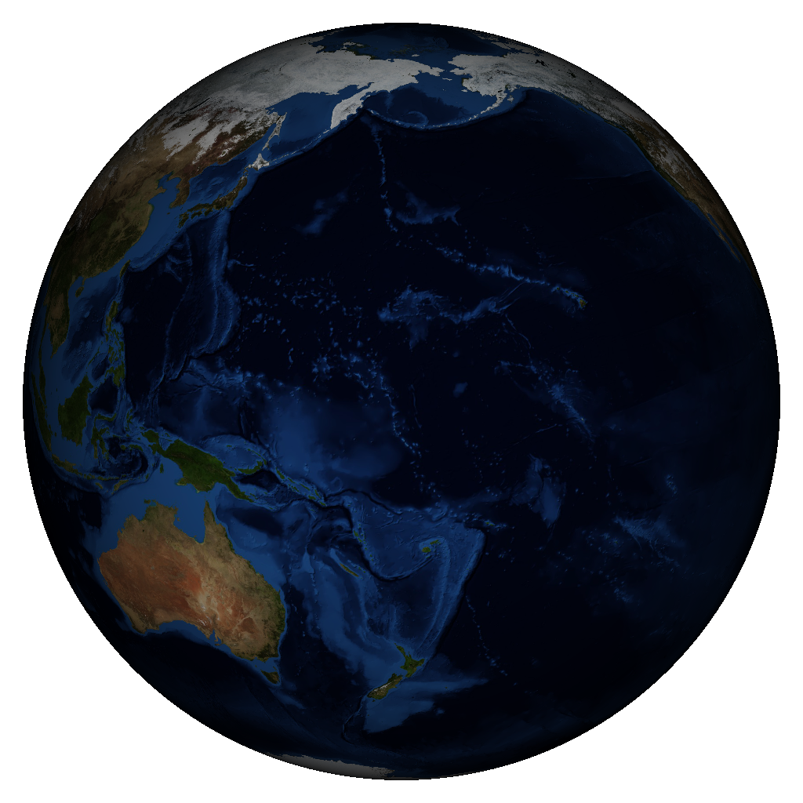<br>
<sub><b>SPICE-driven illumination</b> — fully sunlit Earth at
<code>2026-04-03T00:27:39 UTC</code> (Pacific facing the Sun);
sub-solar = sub-observer.
Built by <code>examples/earth_dayside.py</code>.</sub>
</td>
</tr>
<tr>
<td width="50%" align="center">
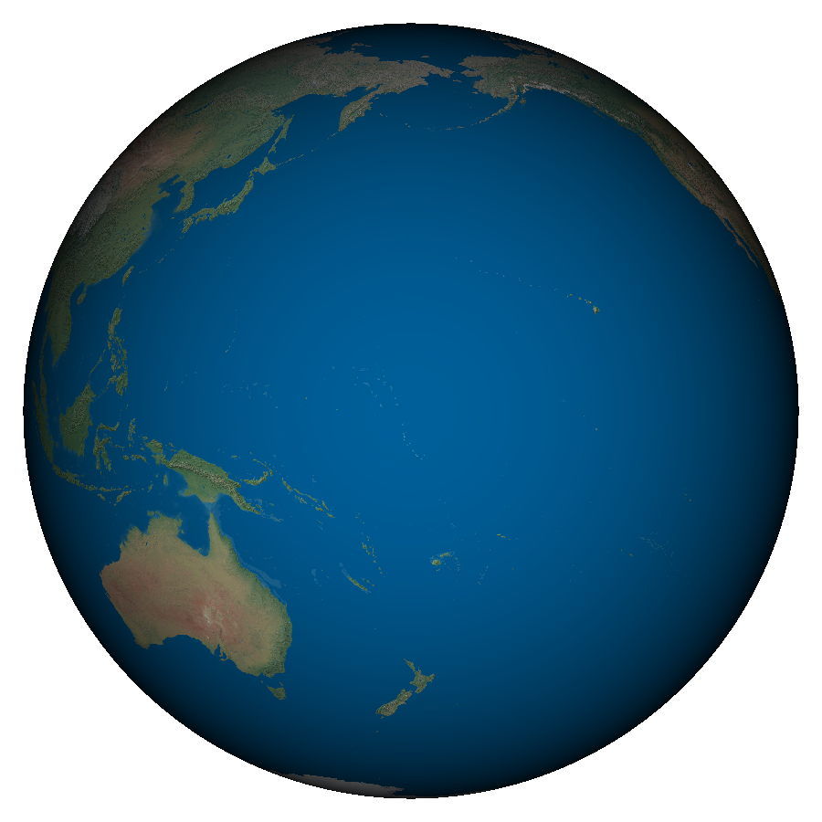<br>
<sub><b>Natural Earth III variant</b> — the more vivid Earth texture
option (<code>get_texture("Earth", "natural_earth3")</code>).
Built by <code>examples/earth_dayside.py</code>.</sub>
</td>
<td width="50%" align="center">
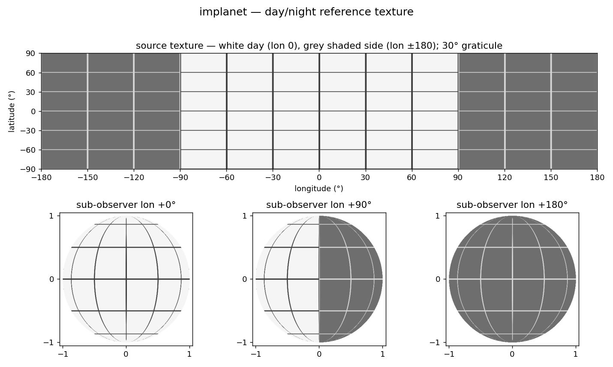<br>
<sub><b>Synthetic day/night reference</b> — built locally (no download)
to verify viewing geometry / lighting / sub-solar lookups.
Built by <code>examples/daynight_reference.py</code>.</sub>
</td>
</tr>
</table>

A full index (with regenerate commands) lives at
[`docs/figures/README.md`](docs/figures/README.md).

### Texture catalog

What you actually get from `get_texture(body)` — one shaded
orthographic disk per body's default variant, same lighting for all.
Regenerate with `python examples/texture_gallery.py`.

<p align="center">
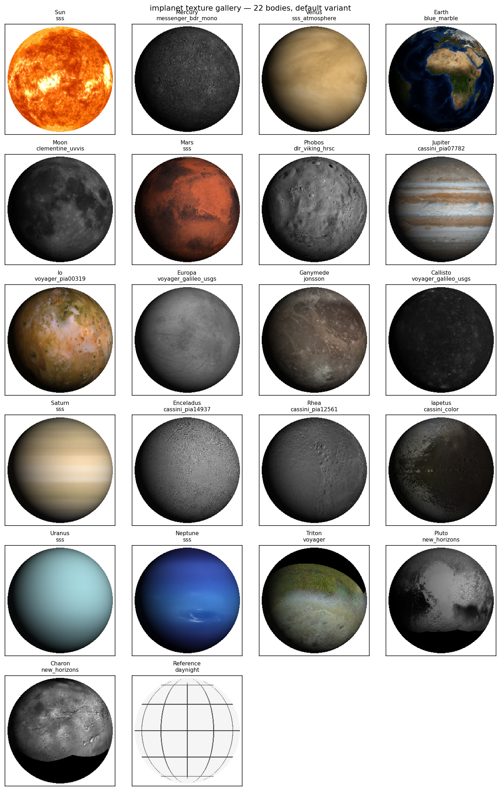
</p>

### Per-body variant comparisons

Several bodies have multiple catalogued textures — different missions,
different processing, day vs. night. Each comparison below renders
every auto-fetchable variant under identical lighting and a fixed
camera. Regenerate any of these with
`python examples/variant_comparison.py` (which writes one PNG per
multi-variant body to `examples/figures_gallery/`).

<table>
<tr>
<td align="center" width="50%">
<b>Mercury</b> (3 variants)<br>
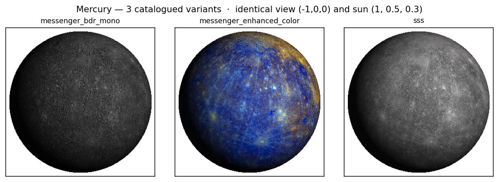<br>
<sub>Default <code>messenger_bdr_mono</code> (B&W BDR basemap),
plus the pseudo-color <code>messenger_enhanced_color</code> and the
Solar System Scope re-processing.</sub>
</td>
<td align="center" width="50%">
<b>Venus</b> (2 variants)<br>
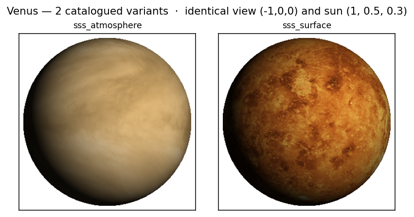<br>
<sub>Cloud-top UV (<code>sss_atmosphere</code>, default) vs. the
Magellan SAR surface mosaic (<code>sss_surface</code>).</sub>
</td>
</tr>
<tr>
<td align="center" width="50%">
<b>Earth</b> (6 variants)<br>
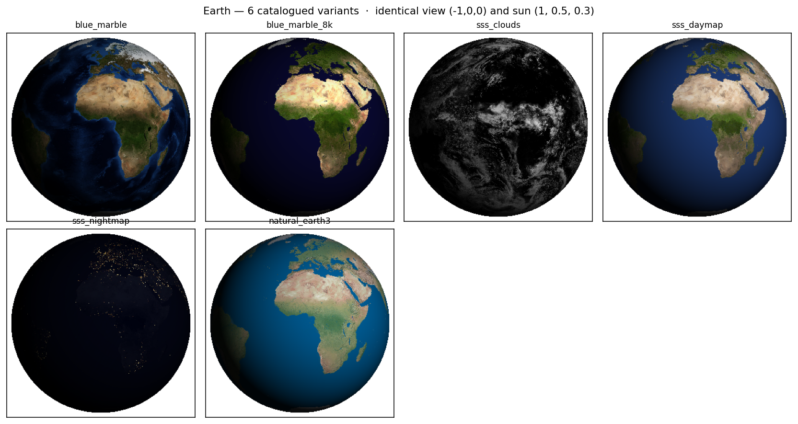<br>
<sub>Blue Marble at two resolutions, the Solar System Scope cloud /
day / night composites, and the vivid Natural Earth III.</sub>
</td>
<td align="center" width="50%">
<b>Moon</b> (4 variants)<br>
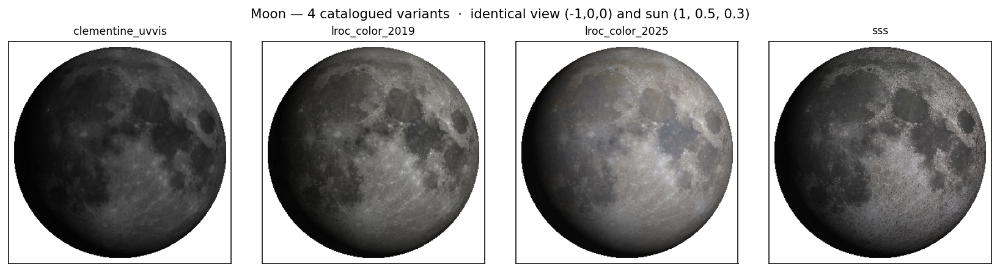<br>
<sub>Clementine UVVIS (default), two LROC color composites, and the
Solar System Scope re-processing.</sub>
</td>
</tr>
<tr>
<td align="center" width="50%">
<b>Mars</b> (2 auto-fetchable variants)<br>
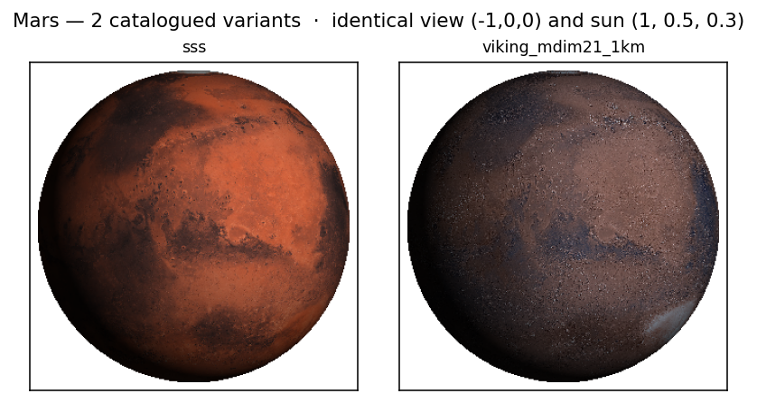<br>
<sub>Solar System Scope (default) vs. the Viking MDIM 2.1 1-km mosaic.
HRSC / Tianwen-1 are manual-only; the 12-GB Viking full-res is
skipped by the gallery script.</sub>
</td>
<td align="center" width="50%">
<b>Jupiter</b> (2 variants)<br>
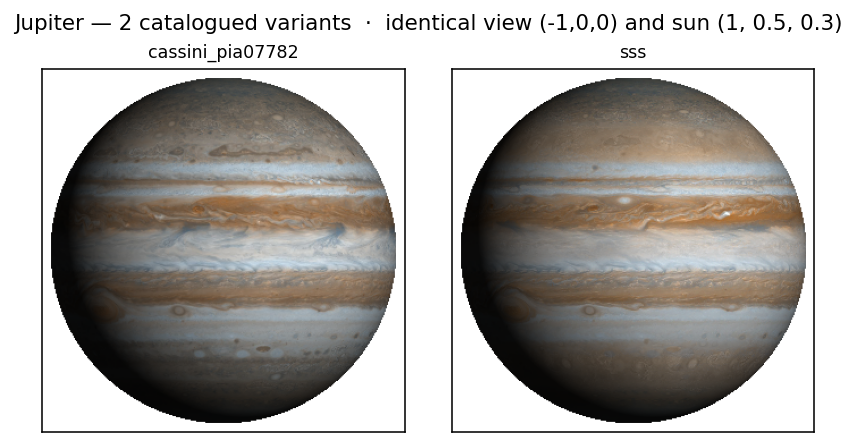<br>
<sub>Cassini ISS PIA07782 (default) vs. the Solar System Scope
composite.</sub>
</td>
</tr>
</table>

## Conventions

All vectors live in the **body-fixed IAU frame** of the rendered body:

- **+Z** — rotation axis (north pole)
- **+X** — prime meridian at the equator
- **+Y** — 90° east longitude
- right-handed

Two vector inputs flip readers up most:

| Argument | Convention |
|---|---|
| `view_direction` | camera **→** planet center |
| `sun_direction` | planet **→** Sun |

The texture is **equirectangular** (2:1 aspect, lon spans 2π, lat spans π,
row 0 = north pole). `lon0` shifts the texture's left edge in radians:

- `lon0=-π` (default) — texture column 0 sits at lon = −180°
- `lon0=0` — texture column 0 sits at the prime meridian

## How rendering works

`render_disk` does orthographic projection of a textured unit sphere
and (optionally) Lambertian shading. All steps are fully vectorized in
NumPy — there are no per-pixel Python loops.

```
   equirectangular           camera basis           visible hemisphere
   texture  T(λ, φ)     ─→   (right, up,    ─→     of unit sphere
   (H, W, C)                  forward)              S² ∩ {P·forward ≤ 0}
                                                          │
                                                          ▼
                                                    image pixel (u, v)
                                                    ─→ 3D point P
                                                    ─→ (lat, lon)
                                                    ─→ bilinear sample T
                                                    ─→ optional shade × albedo
```

### 1.  Camera basis

`camera_basis(view_direction, up=(0,0,1))` builds an orthonormal
triplet `(right, up, forward)` in three lines:

```python
forward = normalize(view_direction)            # camera → planet center
right   = normalize(cross(forward, up_hint))   # in-image horizontal
up_axis = cross(right, forward)                # in-image vertical
```

| axis | direction | fixed by |
|---|---|---|
| `forward` | camera optical axis | `view_direction` |
| `right` | image-plane horizontal (points right on screen) | plane containing `forward` + `up_hint` |
| `up_axis` | image-plane vertical (points up on screen) | enforced perpendicular to both |

The camera sits at −∞·`forward` (orthographic limit), so what reaches
the image plane is a parallel projection of the visible hemisphere
onto the `(right, up_axis)` plane.

**How roll is determined.** A camera has three orientation DOFs: yaw,
pitch, roll. `view_direction` fixes the first two (the *direction* the
camera looks). The third — rotation about the optical axis — is the
*roll*, and it's not an explicit parameter. Instead, the construction
above does a Gram-Schmidt on the `up` hint against `forward` and uses
the result as image-up; that's the "look-at" convention used by
`gluLookAt` and most game/graphics libraries.

With the default `up=(0, 0, 1)` (the body's rotation axis), `up_axis`
is the projection of the **north pole** onto the image plane, so every
render is "north-up" by construction. That's the implicit roll choice.

If `up_hint` is parallel to `forward` (looking straight down a pole)
the cross product collapses and `camera_basis` raises `ValueError` —
for polar views you must pass a non-vertical `up`, e.g.
`up=(1, 0, 0)` to send the prime meridian to image-up.

To pick an *explicit* roll θ about the optical axis, pre-rotate `up`
about `forward` by θ before passing it in (Rodrigues):

```python
import math, numpy as np
f = np.asarray(view_direction, float); f /= np.linalg.norm(f)
k = np.array([0.0, 0.0, 1.0])
up = (k*math.cos(θ) + np.cross(f, k)*math.sin(θ)
      + f*np.dot(f, k)*(1 - math.cos(θ)))
camera_basis(view_direction, up=up)
```

In practice the default is what almost every scientific figure wants
— sub-Earth views of planets are conventionally north-up.

Code: `camera_basis()` in `projection.py`.

### 2.  Pixel → 3D point on the visible hemisphere

Output image pixels (px, py) map to normalized image-plane coordinates

    u = (px − cx) / R           v = −(py − cy) / R

where R is the disk radius in pixels (`min(H, W) / 2 / margin`).
Pixels with u² + v² > 1 fall outside the disk and are filled with
`background`. For the rest, the point on the *near* hemisphere of the
unit sphere is

    z = √(1 − u² − v²)
    P = u·right + v·up − z·forward       (world coords, body-fixed)

The near hemisphere is the one with P·`forward` ≤ 0 — the side facing
the camera. Code: `orthographic_rays()`.

### 3.  Sphere → texture coordinates

For each surface point P = (Px, Py, Pz) on the unit sphere,

    lat = arcsin(Pz)                      ∈ [−π/2, π/2]
    lon = atan2(Py, Px)                   ∈ [−π,    π]

mapped to the texture's normalized coordinates

    u_tex = ((lon − lon0) / 2π)  mod 1
    v_tex = ½ − lat / π

The `mod 1` in u handles longitude wrap-around at the seam; v clamps at
the poles. `lon0` lets you shift textures whose column 0 sits at the
prime meridian instead of −180°. Code: `sphere_to_uv()`.

### 4.  Bilinear sampling with seam-correct wrap

The four neighboring texels around `(u_tex·W − ½, v_tex·H − ½)` are
fetched with **wrap-around in u** and **clamp in v**, then mixed with
fractional weights. Wrapping is what keeps a meridian line continuous
at the texture's left/right seam; clamping prevents bogus reads above
the north pole / below the south. Code: `_sample_bilinear()` in
`render.py`.

### 5.  Optional Lambertian shading

If `sun_direction` *s* (a unit vector, planet → Sun) is given, the
local surface normal on a unit sphere is just P itself, so the cosine
of the solar incidence angle is

    cos i = max(0,  P · s)

The pixel color is then multiplied by

    shade = ambient  +  (1 − ambient) · cos i

with `ambient ∈ [0, 1]` setting the floor on the night side. Setting
`ambient = 1.0` disables shading (used for the Sun and for SAR mosaics
like Venus, whose pixel values already encode reflectance).

### 6.  Compositing

Off-disk pixels are replaced with `background`, the array is clipped
to [0, 255] and cast to `uint8`. Grayscale, RGB, and RGBA all flow
through the same path; the output mode is inferred from the input
channel count.

### Cost

The work is dominated by the `H × W` bilinear gather, which is a
constant 4 lookups per pixel. A 720×720 render of an 8K texture takes
~50 ms on this machine; SPICE-driven calls (`sun_direction`,
`sub_solar_point`) add a few ms each after kernels are cached.

## API

### Layer 1 — Rendering

```python
image = render_disk(
    texture,                       # str/Path | PIL.Image | ndarray (H,W)|(H,W,C)
    view_direction=(1, 0, 0),
    up=(0, 0, 1),                  # world-up hint
    size=512,                      # int or (h, w)
    margin=1.05,                   # 1.0 = disk touches the shorter edge
    lon0=-math.pi,
    sun_direction=None,            # None → flat albedo (no shading)
    ambient=0.15,                  # [0, 1]; floor on Lambertian shading
    background=(255, 255, 255),    # RGB 0-255 *or* a matplotlib color
                                   #   string: "white", "#1f77b4", "0.25"
)
# image: uint8 ndarray (H, W) or (H, W, C); row 0 = top.
# The disk occupies [-1, +1] in planet radii on both axes.
# → Save: Image.fromarray(image).save(...)
# → Plot: ax.imshow(image, extent=(-margin, margin, -margin, margin))
#         ax.set_aspect("equal")
```

```python
output = render_flatmap(
    texture,
    rotation_lon_deg=0.0,          # rolls the body's spin phase
    sun_direction=None,            # None → no shading
    ambient=0.15,
    lon0=-math.pi,
    output_size=None,              # (h, w) or None (= matches texture)
    return_array=False,            # True → ndarray, False → PIL.Image
)
# Produces a full 2:1 equirectangular re-render with optional spin +
# Lambertian shading. Pair with `flatmap_terminator()` to overlay the
# day-night line in lon/lat space.
```

```python
info = render_info(
    texture, view_direction=(1, 0, 0), up=(0, 0, 1),
    size=512, margin=1.05, lon0=-math.pi,
    sun_direction=None, ambient=0.15,
)
# Same signature as render_disk (minus background). Returns a dict:
#   texture → {body, variant, mission, citation, license, …}
#             (populated when texture is a path or Image.open()'d PIL
#              image whose filename is catalogued in manifest.json)
#   camera  → {view_direction, up, sub_observer_lat_deg, …_lon_deg}
#   sun     → {sun_direction, sub_solar_lat_deg, …, ambient} or None
#   output  → {size, margin, lon0}
#   caption → one-line string ready for a figure caption / title
```

### Layer 2 — Geometry primitives

Used internally by `render_disk`, exposed if you need to build your own
pipeline.

```python
camera_basis(view_direction, up=(0,0,1))           # → (right, up, forward)
orthographic_rays(size, right, up, forward, margin=1.0)
                                                   # → (HxWx3 points, HxW mask)
sphere_to_uv(points, lon0=0.0)                     # → (u, v) in [0, 1]
```

### Layer 3 — Overlays (matplotlib-friendly)

Every overlay returns plain x/y arrays in unit-disk coordinates (the
visible hemisphere, u²+v² ≤ 1) so you can `ax.plot(x, y)` them directly
onto a rendered disk — no Nx2 unpacking, no matplotlib dependency in the
overlay layer itself.

```python
graticule_segments(view_direction, up=(0,0,1),
                   lat_step_deg=30, lon_step_deg=30,
                   include_poles=True, samples_per_line=361)
    # → {"parallels": (xs, ys), "meridians": (xs, ys)}
    #   xs, ys are parallel LISTS of 1-D arrays — one polyline per line:
    #   for x, y in zip(*g["parallels"]): ax.plot(x, y)

limb_circle(samples=360)                           # → (x, y)  two 1-D arrays
subobserver_point(view_direction, up=(0,0,1))      # → (lat_deg, lon_deg) floats

terminator_segments(view_direction, sun_direction, up=(0,0,1), samples=361)
    # → (xs, ys)  parallel lists of 1-D arrays: the projected great
    #   circle {P : P · sun_unit = 0}, clipped at the limb.

flatmap_terminator(sun_direction, rotation_lon_deg=0.0, samples=721)
    # → (xs, ys) lon/lat-space terminator for render_flatmap output
```

### Layer 4 — Ephemeris (optional)

```python
from implanet import (
    ensure_kernels, sun_direction, sub_solar_point,
    view_direction_from_earth, known_ephemeris_bodies,
)

ensure_kernels()                                   # one-time ~32 MB download
sun_direction(body, utc, abcorr="LT")              # → unit 3-vec in IAU_<body>
sub_solar_point(body, utc, abcorr="LT")            # → (lat_deg, lon_deg)
view_direction_from_earth(body, utc, abcorr="LT")  # → unit 3-vec in IAU_<body>
known_ephemeris_bodies()                           # list[str]
```

`body` is a name like `"Mars"`. `utc` is any SPICE-parseable string
(`"2026-05-14T12:00:00"`, `"2026 May 14 12:00:00"`, …). `abcorr` is the
NAIF aberration-correction code: `"NONE"`, `"LT"` (default — light-time),
or `"LT+S"` (light-time + stellar aberration).

Supported bodies (22): Sun's neighbors plus moons in DE440s' direct
coverage or close enough that the parent barycenter is a sufficient
proxy.

```
Mercury  Venus  Earth   Moon   Mars      Phobos   Deimos
Jupiter  Io     Europa  Ganymede Callisto
Saturn   Rhea   Iapetus Titan   Enceladus
Uranus   Neptune Triton  Pluto   Charon
```

The Sun is intentionally absent — `sun_direction("Sun", ...)` would be
meaningless; render the Sun's texture flat with `ambient=1.0`.

## Plotting with matplotlib

`render_disk` returns a raw ndarray, so plotting is a one-liner with
`ax.imshow` and the natural extent (the disk lives in `[-1, +1]`
planet radii on both axes, with a `margin` cushion). The Layer-3
overlays return plain `(xs, ys)` arrays so they drop straight onto the
same axes — no extra glue, no matplotlib dependency in the rendering
path:

```python
import matplotlib.pyplot as plt
from implanet import (
    render_disk, render_info, get_texture,
    graticule_segments, limb_circle, terminator_segments,
    subobserver_point,
)

view = (-1, -0.2, -0.3)
sun  = (1, 0.5, 0.4)
margin = 1.05

img = render_disk(get_texture("Earth"),
                  view_direction=view, sun_direction=sun,
                  size=600, margin=margin,
                  background="white")     # mpl color string also works

fig, ax = plt.subplots(figsize=(6, 6))
ax.imshow(img, extent=(-margin, margin, -margin, margin))
ax.set_aspect("equal")
ax.set_xlim(-margin, margin); ax.set_ylim(-margin, margin)
ax.set_xlabel("x [planet radii]"); ax.set_ylabel("y [planet radii]")

# Overlays — every helper returns parallel lists of polylines you can
# loop into ax.plot(...).
g = graticule_segments(view_direction=view, lat_step_deg=30, lon_step_deg=30)
for xs, ys in zip(*g["parallels"]):  ax.plot(xs, ys, ":", color="0.25", lw=0.7)
for xs, ys in zip(*g["meridians"]):  ax.plot(xs, ys, ":", color="0.25", lw=0.7)

lx, ly = limb_circle()
ax.plot(lx, ly, "-", color="black", lw=1.0)

for xs, ys in zip(*terminator_segments(view_direction=view, sun_direction=sun)):
    ax.plot(xs, ys, "--", color="white", lw=1.2)

sub_lat, sub_lon = subobserver_point(view_direction=view)
ax.set_title(render_info(get_texture("Earth"), view_direction=view,
                         sun_direction=sun)["caption"], fontsize=8)
fig.savefig("earth_scientific.png", dpi=140, bbox_inches="tight")
```

### Flatmap with day-night terminator

`render_flatmap` returns a shaded equirectangular re-render (lon on x,
lat on y, both linear) instead of an orthographic disk.
`flatmap_terminator(sun_direction=…)` is its overlay companion — the
day-night great circle expressed in **lon/lat** rather than disk
coordinates, so the same `ax.plot(xs, ys)` pattern works:

```python
import matplotlib.pyplot as plt
from implanet import (
    render_flatmap, flatmap_terminator,
    sun_direction, get_texture,
)

utc = "2026-05-14T12:00:00"
sun = sun_direction("Earth", utc)

# Shade the full equirectangular map for this UTC.
flat = render_flatmap(get_texture("Earth"), sun_direction=sun,
                      ambient=0.05, return_array=True)

fig, ax = plt.subplots(figsize=(8, 4))
ax.imshow(flat, extent=(-180, 180, -90, 90), aspect="auto")

# Overlay the terminator (one or two polyline pieces, depending on the
# sub-solar latitude — at solstice it's a single sinusoid; at equinox
# it wraps around the seam).
for xs, ys in zip(*flatmap_terminator(sun_direction=sun)):
    ax.plot(xs, ys, "--", color="white", lw=1.4)

ax.set_xlabel("longitude (°)"); ax.set_ylabel("latitude (°)")
ax.set_title(f"Earth flatmap with day-night terminator  ·  {utc}")
fig.savefig("earth_flatmap.png", dpi=140, bbox_inches="tight")
```

Result:

<p align="center">
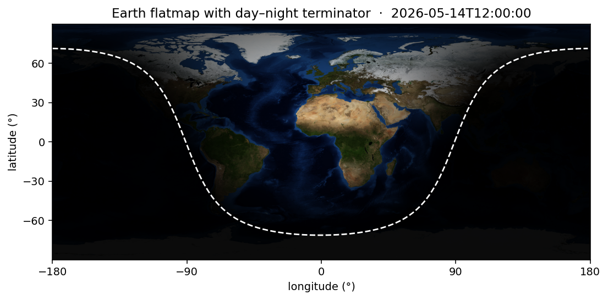
</p>

Pass `rotation_lon_deg=θ` to `render_flatmap` to spin the body under a
fixed sun — handy for stitching rotation-period animations frame by
frame.

## Map sources

`maps/manifest.json` catalogs equirectangular maps from NASA, ESA, JAXA,
and CNSA, plus a few community redistributions. Each entry has:

- `body` + `variant` (composite key — same body can appear multiple times)
- `agency`, `mission`, `instrument`, `description`
- `format`, `resolution`, `size_bytes_estimated`
- `asset_url` (auto-downloadable) and/or `portal_url` (manual)
- `provenance`, `license`, `citation`

**See what's available** (don't rely on a hand-maintained list here — it
goes stale; ask the package):

```python
import implanet
implanet.show_maps()                 # pretty table: body, variant, size, status
implanet.show_maps(body="Earth")     # filter to one body
implanet.list_maps(downloadable_only=True)   # → list[dict], for scripting
```

```bash
implanet-fetch --list                # same catalogue from the shell
implanet-fetch --where               # print the resolved maps directory
```

**Get one map** (lazy, on demand) — usually all you need:

```python
from implanet import get_texture
path = get_texture("Mars")                       # default variant
path = get_texture("Earth", "natural_earth3")    # specific, vivid variant
```

**Bulk-download** the auto-fetchable subset:

```bash
implanet-fetch                       # ~250 MB total
implanet-fetch --body Mars           # filter by body
implanet-fetch --agency NASA         # filter by agency
implanet-fetch --include-large       # also the multi-GB USGS mosaics
```

Status column meaning: `cached` (on disk) · `download` (auto-fetchable)
· `generate` (synthetic, built locally) · `manual` (portal-only — e.g.
Titan's default, ESA HRSC Mars, JAXA Kaguya, CNSA mosaics, full-res USGS;
`get_texture` raises with the portal URL for these).

## Reproducing the demo figures

Scripts under `examples/`:

```bash
# Quick PIL-only rotation/terminator/pole grids
python examples/figures.py            # → examples/figures/*.png

# Animated rotation / sub-solar drift GIFs
python examples/animations.py         # → examples/animations/*.gif

# Per-body equirectangular flatmap re-renders with shading
python examples/flatmap_figures.py    # → examples/figures_flatmap/*.png

# A transparent RGBA disk per body, on an exact [-1,1] grid
python examples/transparent_disks.py  # → examples/figures_transparent/*.png

# Synthetic day/night reference grid (no download)
python examples/daynight_reference.py

# A single sunlit-Earth render driven by SPICE
python examples/earth_dayside.py

# Three quick views: front / side / pole-down
python examples/demo.py
```

All examples write into `examples/<some-output-dir>/` which is
git-ignored; the committed showcase set lives under
[`docs/figures/`](docs/figures/).

## Attribution & citation

`implanet` itself is MIT-licensed. The **maps and SPICE kernels** are
**not** our work — they're redistributions of public-domain or
Creative-Commons assets from NASA, ESA, JAXA, CNSA, USGS, and a few
community texture providers. The terms of those upstream sources apply.

**If you use any rendered figure in a paper or talk, credit both the
mission/instrument and the texture provider.** The manifest's `citation`
field gives the right phrasing per map; e.g.:

> Solar System Scope (CC BY 4.0). Underlying data: NASA MGS MOLA team;
> Viking Orbiter; USGS Astrogeology.

You can read the citation block at runtime so it stays in sync with the
catalogue:

```python
import implanet
implanet.show_attribution("Mars")    # one body, pretty-printed
implanet.show_attribution()          # all 41 entries
implanet.attribution("Earth", "natural_earth3")   # → dict
```

```bash
implanet-fetch --cite                # citation block from the CLI
implanet-fetch --cite --body Mars    # filtered
```

The first time `get_texture(body)` downloads a map, a one-line license
+ cite hint is printed to stderr so the requirement is hard to miss.

For the full block of every catalogued texture and SPICE kernel see
[`ATTRIBUTION.md`](ATTRIBUTION.md) at the repo root (regenerable via
`python scripts/build_attribution.py`).

## References

If you use `implanet` in published work, please cite the package and
the upstream tooling it builds on. **The maps and SPICE kernels each
carry their own citation** — see the
[Attribution & citation](#attribution--citation) section above and the
per-entry `citation` field in `maps/manifest.json` (also exposed via
`implanet.show_attribution(...)` and as a one-liner in
`render_info(...)["caption"]`).

**Citing implanet**

```bibtex
@software{implanet,
  title  = {implanet: orthographic planet renderer with SPICE-driven sun lighting},
  author = {Zhao, Jiutong},
  year   = {2026},
  url    = {https://github.com/jiutongzhao/implanet},
  note   = {MIT-licensed Python package}
}
```

**SPICE / NAIF.** The ephemeris layer (`implanet.ephemeris`) wraps the
NAIF SPICE toolkit through `spiceypy`. If you publish a result that
relies on `sun_direction`, `sub_solar_point`, or any mission SPK in
this catalogue, cite:

> Acton, C. H. (1996). *Ancillary data services of NASA's Navigation
> and Ancillary Information Facility.* Planetary and Space Science,
> 44(1), 65–70. <https://doi.org/10.1016/0032-0633(95)00107-7>

> Acton, C., Bachman, N., Semenov, B., & Wright, E. (2018). *A look
> towards the future in the handling of space science mission
> geometry.* Planetary and Space Science, 150, 9–12.
> <https://doi.org/10.1016/j.pss.2017.02.013>

**Rendering pipeline.** The orthographic projection + Lambertian
shading + bilinear sampling here is textbook computer-graphics
machinery; consult any introductory CG text (e.g. Foley et al.,
*Computer Graphics: Principles and Practice*) for derivations.

**Data sources.** Catalogued in
[`ATTRIBUTION.md`](ATTRIBUTION.md) — one entry per texture + SPICE
kernel, with provenance, license, and citation text. Always cite the
mission/instrument **and** the texture provider in figure captions.

## Tests

```bash
pip install -e .[test]
pytest tests/                       # 44 tests, ~1 s
```

`tests/test_render.py` covers basis orthonormality, disk geometry,
sphere→uv mapping, hemisphere correctness, terminator shading,
path/PIL/array texture inputs, and the `render_info` metadata helper.
`tests/test_assets.py` covers the registry/cache layer (resolution
order, packaged-registry sync, the synthetic texture, the
`attribution()` API, and an ATTRIBUTION.md drift check).
`tests/test_ephemeris.py` sanity-checks SPICE-derived geometry against
physical reality (Mercury obliquity ≈ 0, Uranus obliquity dominates,
sun near Greenwich at equinox noon UTC) and auto-skips if `spiceypy`
or the kernels are absent.

## File layout

```
implanet/
├── __init__.py            # public API + lazy ephemeris import
├── projection.py          # camera_basis, orthographic_rays, sphere_to_uv
├── render.py              # render_disk, render_flatmap, render_info
├── overlays.py            # graticule/limb/terminator/subobserver
├── ephemeris.py           # SPICE wrappers  (spiceypy)
├── fetch.py               # `implanet-fetch` console script
└── assets/                # registry + lazy download/cache
    ├── __init__.py        #   get_texture, get_kernel, list_maps,
    │                      #   show_maps, attribution, show_attribution
    ├── _registry.py _cache.py _synthetic.py
    └── data/              #   packaged copies of the registry JSON

maps/
├── manifest.json          # 41 entries, 23 bodies (textures)
├── kernels.json           # 15 entries (SPICE kernels)
└── data/                  # texture cache (dev checkout)

kernels/                   # SPICE cache (dev checkout); pip → implanet/_data
scripts/                   # fetch_maps.py / sync_registry.py /
                           # build_attribution.py (dev helpers)
ATTRIBUTION.md             # human-browseable license/citation index,
                           # regenerated from manifest.json + kernels.json
examples/                  # demo.py, figures.py, animations.py,
                           # flatmap_figures.py, transparent_disks.py,
                           # earth_dayside.py, daynight_reference.py
tests/                     # test_render.py, test_assets.py,
                           # test_ephemeris.py, _cli_tool.py (dev-only
                           #   ad-hoc render CLI; not shipped)
```
