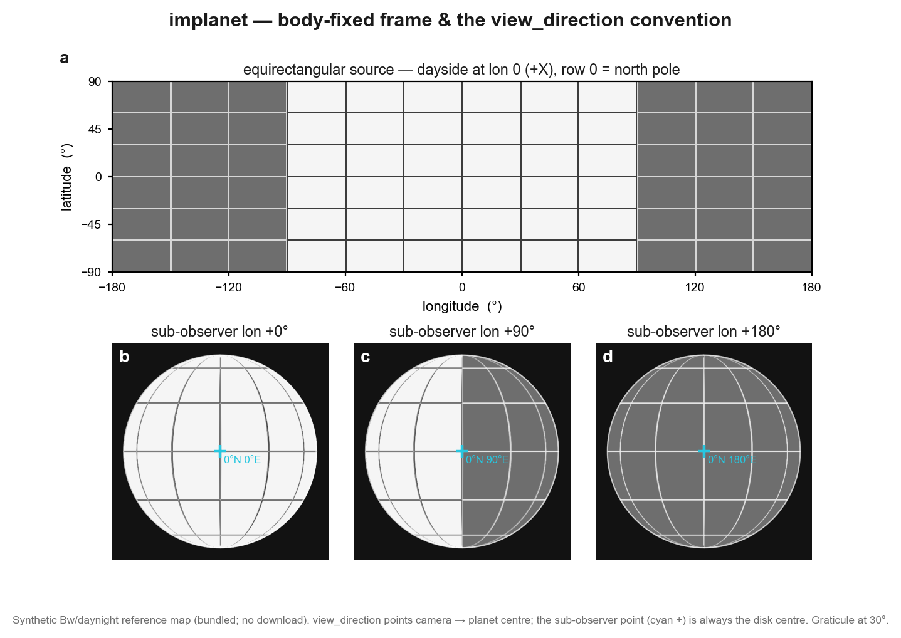
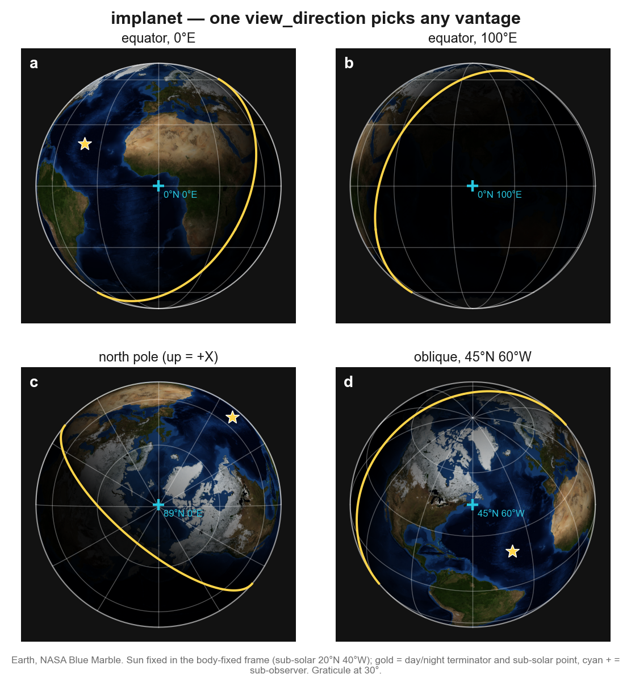
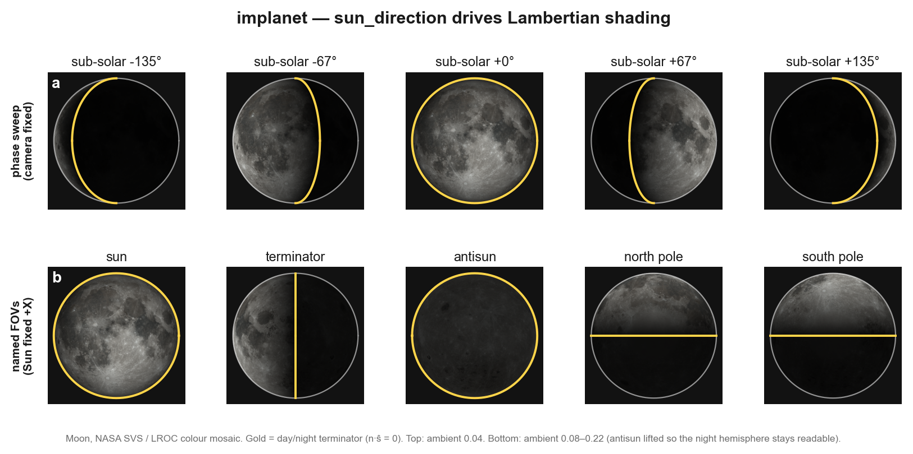
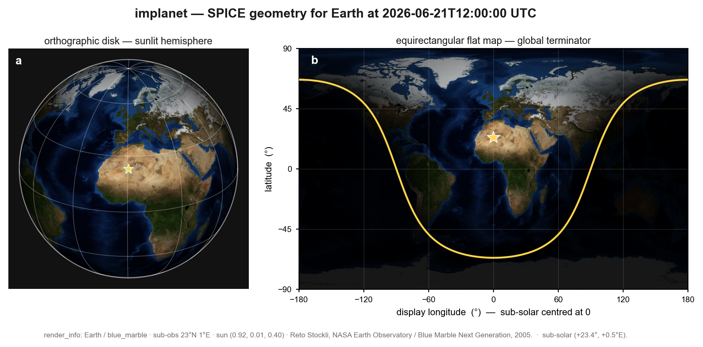
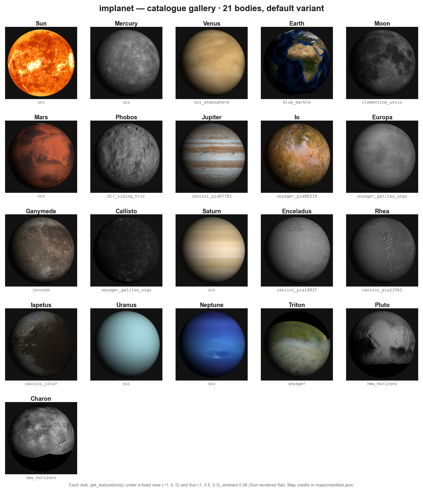
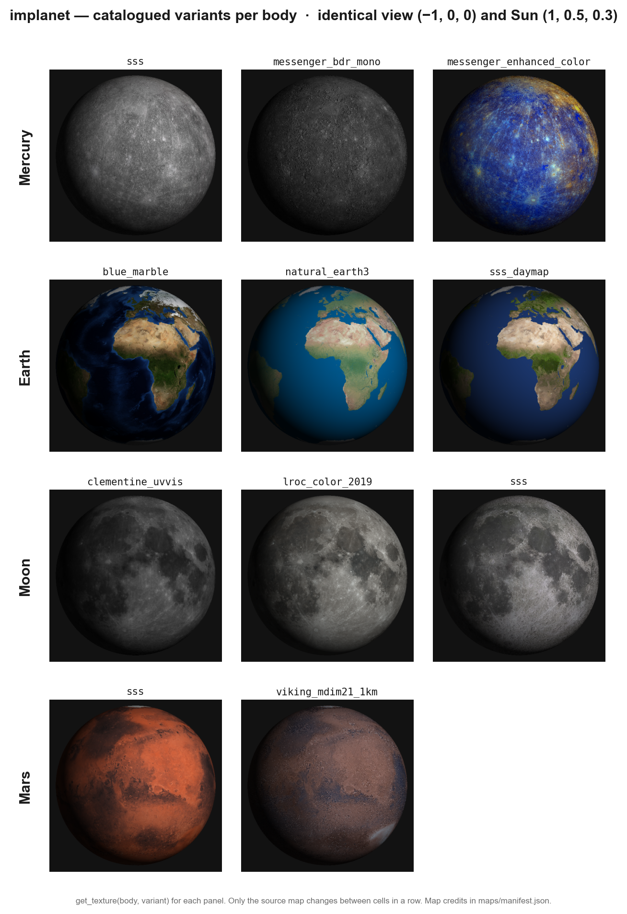

# Publication figure series

A six-plate, publication-grade reworking of the `examples/` demos —
image-plate figures (raster planet disks rendered by `implanet`) with
**editable vector overlays and text** on top: graticules, the day/night
terminator, and sub-observer / sub-solar markers, all drawn from the
package's own overlay functions.

Regenerate the whole set with:

```bash
python examples/nature/make_all.py
```

Each plate is written in three formats: a light **`.png`** preview
(committed, shown below) plus editable **`.pdf`** and **`.svg`** masters
for figure assembly (300 dpi, text kept as `<text>` nodes — gitignored,
regenerate from the scripts).

| Plate | Core conclusion | Script | Supersedes |
|---|---|---|---|
| **Fig 1**  | Equirectangular map → orthographic disk in the body-fixed IAU frame; `view_direction` (camera→centre) picks the hemisphere, sub-observer point at disk centre. | `fig01_frame_and_projection.py` | `daynight_reference.py`, `demo.py` |
| **Fig 2**  | One `view_direction` (+ `up` for roll) reaches any vantage — equator, oblique, pole — with the graticule re-projecting correctly. | `fig02_viewing_geometry.py` | `figures.py` (Earth views) |
| **Fig 3**  | `sun_direction` drives Lambertian shading: fix the camera and sweep the Sun → phases; fix the Sun and move the camera → named FOVs. | `fig03_illumination.py` | `figures.py` (Moon phases), `disk_views.py` |
| **Fig 4**  | Real SPICE geometry poses the body physically: sunlit orthographic disk + `render_flatmap` global terminator for the same UTC. | `fig04_earth_spice.py` | `earth_dayside.py`, `flatmap_figures.py` |
| **Fig 5**  | `get_texture(body)` inventory — every catalogued body's default map under one fixed view and Sun. | `fig05_texture_gallery.py` | `texture_gallery.py` |
| **Fig 6**  | Catalogued variants per body (mission / instrument / colour processing) under identical lighting, so only the map differs. | `fig06_variant_comparison.py` | `variant_comparison.py` |

Shared style (rcParams, palette, disk-axes helpers, the overlay drawers,
and the `.png`/`.pdf`/`.svg` saver) lives in `examples/nature/_style.py`.

Overlays land on the rendered shading boundary by construction — Fig 4's
flat-map terminator, for instance, traces the great circle `n·ŝ = 0` and
matches `render_flatmap`'s day/night split to within a pixel.

> Note: `examples/animations.py` (GIFs) has no still-figure equivalent
> here — animations are out of scope for a static publication set.
